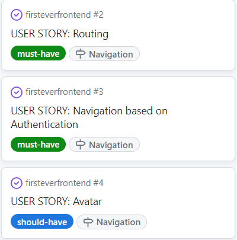
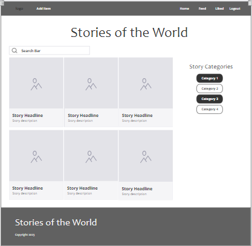

# Stories of the World

## Project goals

Stories of the World is a social media platform designed to share stories of any kind: invented stories, stories a user experienced while traveling, myths that the user listened to in her own or in another country, legends about historical characters or childrens' stories - and all of them from all around the world.   The focus is on the text instead of the images like on other social media platforms, however, for aestetic purposes, each story is accompanied by any kind of image (photo/drawing/etc.). Users will be able to like a story, to look at all stories from one specific storyteller and to follow a storyteller they especially like. Also they will be able to comment on stories from other storytellers.
  
Enough of talking, let's collect stories!

## Table of contents
- [Stories](#stories)
  * [Project goals](#project-goals)
  * [Table of contents](#table-of-contents)
  * [User stories](#user-stories)
    + [Epics](#epics)
    + [User stories](#user-stories-1)
  * [Agile development methodology](#agile-development-methodology)
  * [Planning](#planning)
    + [Mockups](#mockups)
    + [Data models](#data-models)
  * [Design](#design)
    + [Colours](#colours)
    + [Fonts](#fonts)
  * [Features](#features)
    + [CRUD functionality](#crud-functionality)
    + [Future improvements and features](#future-improvements-and-features)
  * [Technologies Used](#technologies-used)
    + [Frameworks, libraries and dependencies](#frameworks--libraries-and-dependencies)
    + [Other Technologies](#other-technologies)
  * [React features used to enhance user experience](#react-features-used-to-enhance-user-experience)
    + [Custom hooks](#custom-hooks)
  * [Testing](#testing)
    + [Manual testing](#manual-testing)
    + [Validator testing](#validator-testing)
    + [W3C CSS validator](#w3c-css-validator)
    + [ESLint JavaScript validator](#eslint-javascript-validator)
    + [WAVE web accessability testing](#wave-web-accessability-testing)
    + [Lighthouse testing](#lighthouse-testing)
    + [Resolved bugs](#resolved-bugs)
    + [Unresolved bugs](#unresolved-bugs)
  * [Deployment](#deployment)
  * [Credits](#credits)
    + [Code](#code)
    + [Media](#media)

## User stories

### Epics

Epics were developed as a tool of agile development to give some structure to the development process. The following epics were defined:  

NAVIGATION - regarding the navigation on the website  
AUTHENTICATION - regarding the authentication and authorization features of the website  
CONTENT CREATION - regarding the creation of content: stories (posts), likes, follow/unfollow-functionality, comments, profiles  
CONTENT VIEWING - regarding the viewing of content: stories (posts), likes, follow/unfollow-functionality, comments, profiles  

### User stories
NAVIGATION: 
1. Navigation between pages: As a user I can view a navbar from every page so that I can navigate easily between pages
2. Routing: As a user I can navigate through pages quickly so that I can view content seamlessly without page refresh
3. Navigation based on Authentication: Conditional rendering - As a logged out user I can see sign in and sign up options so that I can sign in/sign up, whereas as a logged in user I can post stories, look at my feed and the stories I liked, as well as logout
4. Avatar: As a user I can view other users' avatars so that I can easily identify the users of the application
  AUTHENTICATION:  
5. Sign up: As a user I can create a new account so that I can access all the features for signed up users
6. Sign in: As a user I can sign in to the app so that I can access functionality for logged in users
7. Logged in Status: As a user I can tell if I am logged in or not so that I can log in if I need to
8. Refreshing access tokens: As a user I can maintain my logged-in status until I choose to log out so that my user experience is not compromised
  CONTENT CREATION:  
9. Create stories: As a logged in user I can create stories (posts) so that I can share my stories with the other users
10. Like stories: As a logged in user I can like a story so that I can show my support for the stories that interest me
11. Edit story: As a story owner I can edit my story title, description and content so that I can make corrections or update my story after it was created
12. Create a comment: As a logged in user I can add comments to a story so that I can share my thoughts about the story
13. Delete comments: As an owner of a comment I can delete my comment so that I can control removal of my comment from the application
14. Edit a comment: As an owner of a comment I can edit my comment so that I can fix or update my existing comment
15. Follow/Unfollow a user: As a logged in user I can follow and unfollow other users so that I can see and remove stories by specific users in my stories feed
16. Edit profile: As a logged in user I can edit my profile so that I can change my profile picture etc.
17. Update username and password: As a logged in user I can update my username and password so that I can change my display name and keep my profile secure
  CONTENT VIEWING:  
18. View most recent stories: As a user I can view all the most recent stories, ordered by most recently created first so that I am up to date with the newest content
19. search for keywords: As a user, I can search for stories with keywords, so that I can find the stories I am most interested in
20. View liked posts: As a logged in user I can view the stories I liked so that I can find the stories I enjoyed the most
21. View stories of followed users: As a logged in user I can view content filtered by users I follow so that I can keep up to date with what they are posting about
22. Infinite scroll: As a user I can keep scrolling through the content on the site, that is loaded for me automatically so that I don't have to click on "next page"
23. Detail Story Page: As a user I can view the stories page so that I can read the whole story and comments about the it
24. Comment date: As a user I can see how long ago a comment was made so that I know how old a comment is
25. View comments: As a user I can read comments on stories so that I can read what other users think about it
26. Profile page: As a user I can view other users profiles so that I can see all of their stories and can follow them
27. User profile - user stats: As a user I can view statistics about a specific user: number of stories, follows and users followed so that I can learn about them
28. View all stories by a specific user: As a user I can view all the stories by a specific user so that I can catch up on their latest posts, or decide if I want to follow them

## Agile development methodology
GitHub issues and projects were used to document and track an agile development approach. A GitHub issue was created for each user story, with labels if the user story belongs to the "must-haves", "should-haves" or "nice-to-haves". GitHub milestones were created to represent the epics.

A project kanban board was used to track progress, with user stories moved between 'Todo', 'In Progress' and 'Done' columns as appropriate.

The project board in its final form can be accessed at [Stories of the World GitHub Project](https://github.com/users/ellikarg/projects/3).

## Planning

### Mockups

Homepage

### Data models

## Design

### Colours

### Fonts

## Features

### CRUD functionality

### Future improvements and features

## Technologies Used

### Frameworks, libraries and dependencies
- [react-router-dom](https://www.npmjs.com/package/react-router-dom) - this library enables 'client side routing' for React web applications, and is used to implement basic routing in TribeHub, i.e. to implement the links on the bottom navbar, and register, sign-in and sign-out links. Using React-Router-DOM also enabled implementation of 'single page mode'to enhance the experience for users on larger screens. The `useSinglePage` custom hook is referenced in `App.js`, with different `Route` components conditionally rendered for the various paths depending on whether the app is running in single page mode. The `useLocation` hook from React-Router-DOM is used in some components to determine the current URL and respond accordingly, for example by ensuring the correct nav button is highlighted in the bottom navbar for mobile users.
- [react-dom](https://reactjs.org/docs/react-dom.html) - react-dom is used to manipulate the DOM outside of a specific component, and supports the user experience by enabling modal dialogs to be appended to the top level of the DOM (important for accessability) and alerts to be appended to specific components. For example, notifications are fetched by the NotificationsMenu component, but this takes the form of a dropdown menu, so using ReactDOM allows the component to 'reach out' into the DOM and display error alerts in a more obvious location than inside the dropdown.
- [Axios](https://www.npmjs.com/package/axios) - the axios library was chosen to simplify making HTTP requests to the REST API (e.g. not having to manually configure HTTP headers), and because it enables simple implementation of 'interceptors' which are used to request a refresh token in the event of a HTTP 401 error. This enhances the user experience beacuse an authenticated user remains signed in for up to 24 hours, rather than having to sign in again after five minutes.
- [jwt-decode](https://www.npmjs.com/package/jwt-decode) - used to decode Base64URL encoded JSON web tokens.
- [TailwindCSS](https://tailwindcss.com/) - TailwindCSS was chosen partly in order to gain experience with an alternative to Bootstrap, and for its flexibility and quality of documentation.
- [daisyUI](https://daisyui.com/) - this CSS component library is a TailwindCSS plugin, specifically chosen because of the 'bottom navigation' component which allowed quick implementation of a mobile-app style navbar at the bottom of the screen to provide a high quality mobile first user experience, and it's simple customisable colour theme functionality which enables a website to be built with a small number of colours represented by semantic CSS classes. This was well suited to TribeHub, which only requires a small number of colours with an emphasis on easy identification of UI elements. DaisyUI also supports specific dark mode themes, and although not a primary reason for choosing this library, the feature was utilised for an additional 'quick win' in terms of user experience.
- [React Bootstrap Icons](https://www.npmjs.com/package/react-bootstrap-icons) - this icon library was selected for the high quality and simplicity of the icons, and easy integration with React.

### Other Technologies
* [Gitpod](https://cloudinary.com/) as the IDE
* [Git](https://git-scm.com/) used for version control via the terminal in Gitpod
* [GitHub](https://github.com/) used to store the code in the repository
* [Heroku](https://www.heroku.com/) was used as the cloud based platform for deployment

* [Fontawesome](https://fontawesome.com/) for icons
* [Cacoo](https://www.cacoo.com/) for the wireframes
* [Iloveimg](https://iloveimg.com/) to resize images
* [Coolors](https://coolors.co) to generate the colour palette
* [Am I responsive](https://ui.dev/amiresponsive) to generate the mockup

* [Google Chrome Dev Tools](https://developer.chrome.com/docs/devtools/) for inspection during development to check reponsiveness and contrast and JS errors in the console
* [W3C Markup Validation Service](https://validator.w3.org/)
* [W3C CSS Validation Service(Jigsaw)](https://jigsaw.w3.org/css-validator/)
* [PEP8](https://www.python.org/dev/peps/pep-0008/) to validate the Python code
* Lighthouse in dev tools for testing

## Testing

### Manual testing

### Validator testing

### W3C CSS validator

### ESLint JavaScript validator

### WAVE web accessability testing

### Lighthouse testing

### Resolved bugs

### Unresolved bugs

## Deployment
To deploy to Heroku, follow these steps:

- Fork or clone this repository in GitHub.
- If you have also cloned and deployed your own version of the TribeHub Django Rest Framework API, you will need to ensure the value of `axios.defaults.baseURL` in `src/api/axiosDefaults.js` is set to the base URL for your API. Pull to your local development environment and push back to GitHub if necessary; otherwise, leave as is to use the original TribeHub API.
- Log in to Heroku.
- Select 'Create new app' from the 'New' menu at the top right.
- Enter a name for the app and select the appropriate region.
- Select 'Create app'.
- Select the 'Deploy' tab at the top.
- Select 'GitHub' from the deployment method options to confirm you wish to deploy using GitHub. You may be asked to enter your GitHub password.
- Find the 'Connect to GitHub' section and use the search box to locate your repo.
- Select 'Connect' when found.
- Optionally choose the main branch under 'Automatic Deploys' and select 'Enable Automatic Deploys' if you wish your deployed site to be automatically redeployed every time you push changes to GitHub.
- Find the 'Manual Deploy' section, choose 'main' as the branch to deploy and select 'Deploy Branch'.

When deployment is complete, you will be given a link to the deployed site.

## Credits

### Code
- for including the Quill Editor I used the official Quill documentation

### Media
- Post of Besouro Preto de Mangangá: Text (https://papoeira.com/en/who-was-besouro-preto-de-manganga/), Image (https://br.freepik.com/vetores-gratis/mao-desenhada-de-besouro-preto-scutellated_3132785.htm)
- Testimages for Testposts: https://pixabay.com/photos/forest-trees-sun-rays-sunlight-fog-1072828/
