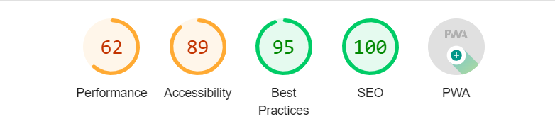

## Testing

Testing file for the Stories of the World React frontend project. [Go back to the README](README.md).

### Manual testing

### Validator testing

#### W3C CSS validator

The deployed website was passed through the W3C validator without errors. There were, however, lots of warnings regarding Bootstrap. This is a common problem and will be ignored in this case.

W3C Css Validation Results

#### ESLint JavaScript validator

For the JS Validation, eslint was installed and validation commands were run from the console. [This tutorial](https://gist.github.com/ianmeigh/8e603b91a38d7829d959402bfcf29d3d) was used for installation and running the tests. Screenshots of the results can be found below:

ESLint JavaScript Validation Results

  And after fixing some errors on the Profiles page:

#### WAVE web accessability testing

Wave was used to test the accessibility of the website and there were no errors found. A screenshot of the result can be found below.

Wave Validation Results

#### Lighthouse testing

Lighthouse testing was performed as well, where Accessibility, Best Practices and SEO results were fine (tested in an inkognito tab), although the performance was not the best. This is mainly due to the images which were updoaded by the users of Stories of the World. In the future and in a real-world scenario this should be tackled either before the first users start uploading images.

Lighthouse Validation Results

### Resolved bugs

| No | Bug | How I solved the issue |
| :--- | :--- | :--- |
| 1 | Collapsable Bootstrap Navbar did not work | import "bootstrap/js/src/collapse.js"; in the NavBar.js file |
| 2 | Image Upload had an automatically created input form underneath the upload area |  add to App.module.css: input[type="file"] {display: none;} |
| 3 | Category field displayd the id instead of the name in the story-card (Post.js) | Making a category_name field in the serializer of the Post model in the backend and then importing directly category_name |
| 4 | Category was saved to the backend as a string when creating a post | using value={c.id} as a property of the option-tag inside the dropdown for the categories (PostCreateForm.js & PostEditForm.js) |
| 5 | eslint threw an error for the ThreeDot variable in the MoreDropdown Component, saying that is missing a display name  | Setting the display name manually (ThreeDots.displayName = 'ThreeDots';) fixed the issue ([source])(https://bobbyhadz.com/blog/react-component-is-missing-display-name) |
| 6 | after installing eslint I got an error saying the babel-preset-react-app is not maintianed anymore. It is thus unlikely that this bug will
ever be fixed | Installing `@babel/plugin-proposal-private-property-in-object` fixed the issue ([source](https://stackoverflow.com/questions/76435306/babel-preset-react-app-is-importing-the-babel-plugin-proposal-private-propert) |

### Unresolved bugs

| No | Bug | 
| :--- | :--- |
| 1 | The process of registration seems to be faulty on some iOS devices. No such problems were encoutered with android or windows. When a user tries to login, she is taken back to the registration site. Since I am not using iOS, it is difficult to fix and test the issue extensively. In a real-world case I would try to get a device runnint with iOS and try fixing the problem with it |
